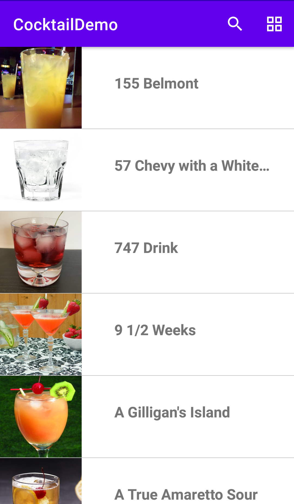
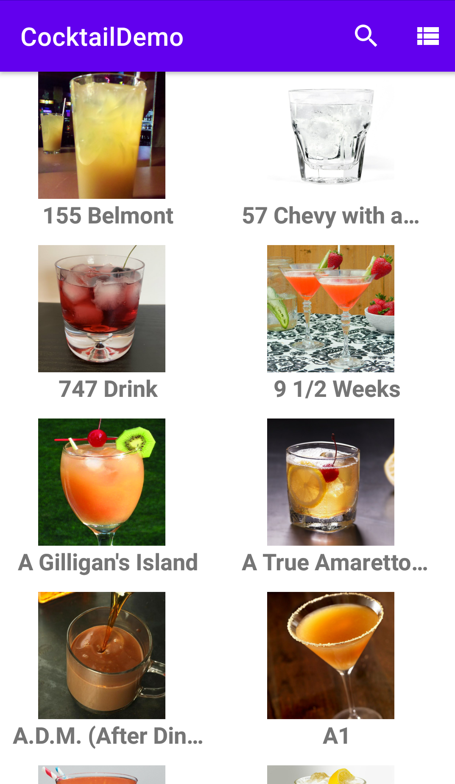
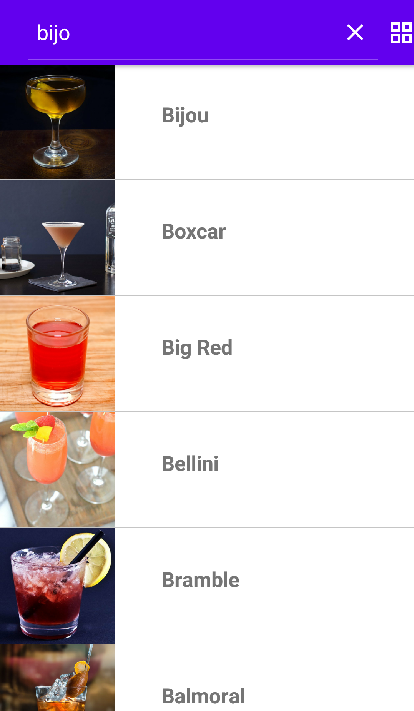
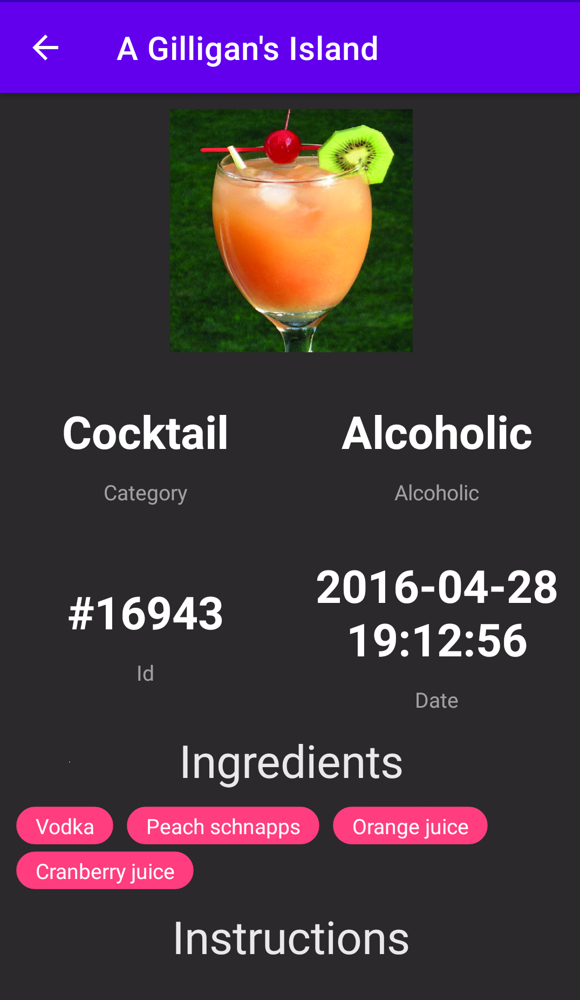

# Cocktail MVVM
A simple Android application to show the MVVM design pattern usage.

https://www.thecocktaildb.com/

## Screenshots

## Features / Implemented functions

- [x] 100% Kotlin app.
- [x] Following Clean Architecture approach.
- [x] Following MVVM Architectural Design Pattern.
- [x] Using search field.
- [x] Option change of view type in main activity.
- [x] Controlled screen rotation.

## Libraries
- [x] Gson.
- [x] Glide.
- [x] LiveCycle.
- [x] Retrofit.
- [x] Tag group.
